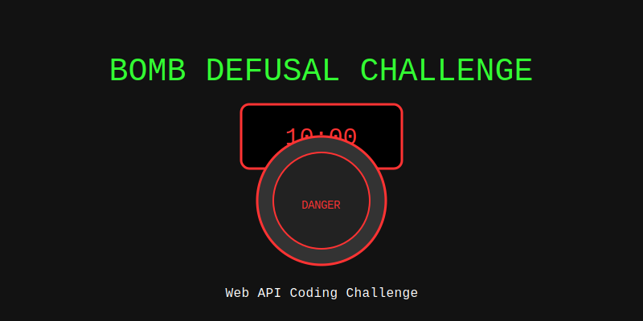

# Bomb Defusal Challenge

An interactive web application where users must defuse a virtual bomb using various Web APIs. This application serves as a basis for a coding dojo where three teams work in pair programming to implement different web API features.



## 🚨 Overview

The Bomb Defusal Challenge is a step-by-step interactive game where users must:

1. **Find the bomb** using the Geolocation API
2. **Unlock the bomb** using the Speech Recognition API
3. **Defuse the bomb** using the Device Orientation API

All while racing against a countdown timer!

## 🚀 Quick Start

```bash
# Install dependencies
npm install

# Start the development server
npm run dev

# Build for production
npm run build

# Preview production build
npm run preview
```

## 🧩 Project Structure

The project follows a modular architecture where each team can work on their own module:

```
src/
├── App.vue               # Main application component
├── main.ts               # Entry point
├── components/           # Shared components
│   └── shared/
│       └── CountdownTimer.vue
├── modules/              # API modules (one per team)
│   ├── geolocation/
│   ├── speech-recognition/
│   └── device-orientation/
├── router/               # Routing configuration
│   └── index.ts
└── views/                # Challenge step views
    ├── HomeView.vue
    ├── FindBombLocationView.vue
    ├── UnlockBombView.vue
    ├── DefuseBombView.vue
    └── GameOverView.vue
```

## 👥 Team Assignments

### Team 1: Geolocation Challenge

**Files to Modify:**
- `src/modules/geolocation/GeolocationApi.ts`
- `src/views/FindBombLocationView.vue`

**Objective:**
Implement the browser's Geolocation API to help users find the bomb location within a 1km radius. Users need to get within 50m of the target to proceed.

**Resources:**
- [Geolocation API Documentation](https://whatwebcando.today/geolocation.html)
- [MDN: Using Geolocation](https://developer.mozilla.org/en-US/docs/Web/API/Geolocation_API/Using_the_Geolocation_API)

### Team 2: Speech Recognition Challenge

**Files to Modify:**
- `src/modules/speech-recognition/SpeechRecognitionApi.ts`
- `src/views/UnlockBombView.vue`

**Objective:**
Implement the Web Speech Recognition API to unlock the bomb by speaking the correct code. The system must recognize spoken words and match them against a list of possible codes.

**Resources:**
- [Speech Recognition API Documentation](https://whatwebcando.today/speech-recognition.html)
- [MDN: Web Speech API](https://developer.mozilla.org/en-US/docs/Web/API/Web_Speech_API)

### Team 3: Device Orientation Challenge

**Files to Modify:**
- `src/modules/device-orientation/DeviceOrientationApi.ts`
- `src/views/DefuseBombView.vue`

**Objective:**
Implement the Device Orientation API to defuse the bomb by keeping the device perfectly level for a specified duration.

**Resources:**
- [Device Orientation API Documentation](https://whatwebcando.today/device-position.html)
- [MDN: Device Orientation Events](https://developer.mozilla.org/en-US/docs/Web/API/Device_orientation_events)

## ✅ Requirements

Each team's implementation must:

1. Include proper error handling for unsupported APIs
2. Provide clear visual feedback to the user
3. Follow best practices for the specific API
4. Include detailed code comments explaining the code
5. Successfully transition to the next challenge when completed

## 🧪 Testing Tips

- **Geolocation**: Use browser developer tools to simulate different locations
- **Speech Recognition**: Test in Chrome or Edge (best support)
- **Device Orientation**: Use browser developer tools or test on a mobile device

## 📱 Browser Compatibility

For the best experience, use:
- Chrome (desktop and mobile)
- Edge (desktop)
- Safari (iOS) for device orientation features

## 🛠 Deployment

The application is automatically deployed to GitHub Pages when changes are merged into the main branch.

## 🧠 Learning Objectives

- Working with modern browser APIs
- Implementing responsive and interactive web applications
- Understanding device capabilities in web browsers
- Practicing pair programming and team collaboration
- Building modular and maintainable code
